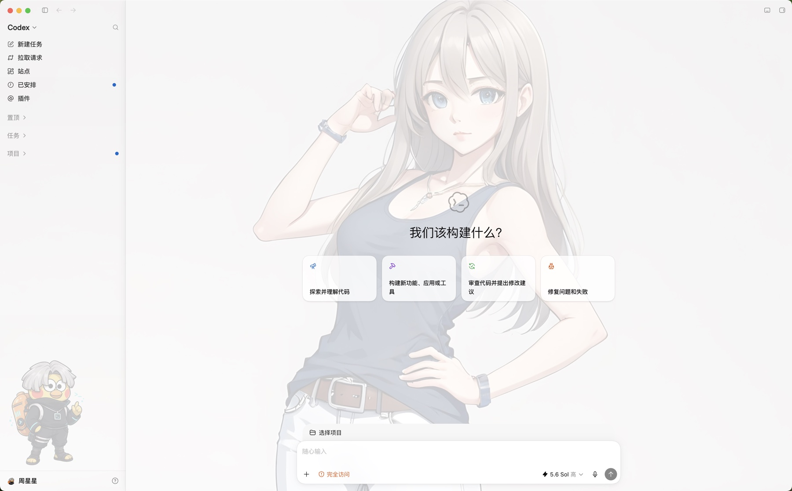
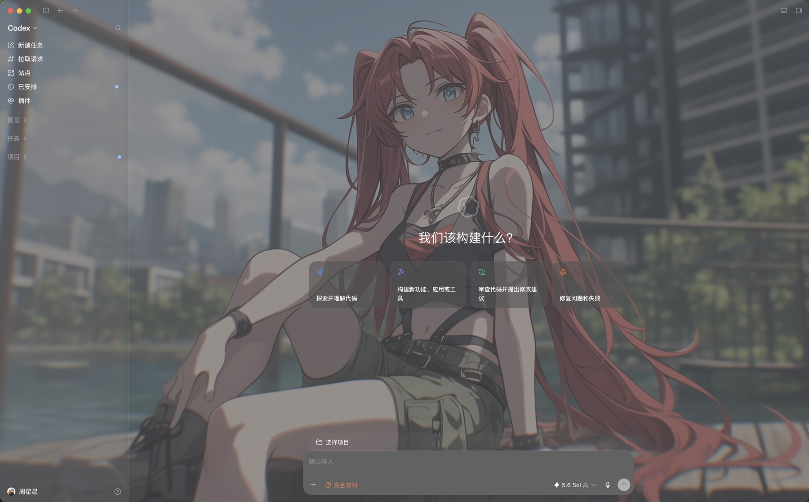
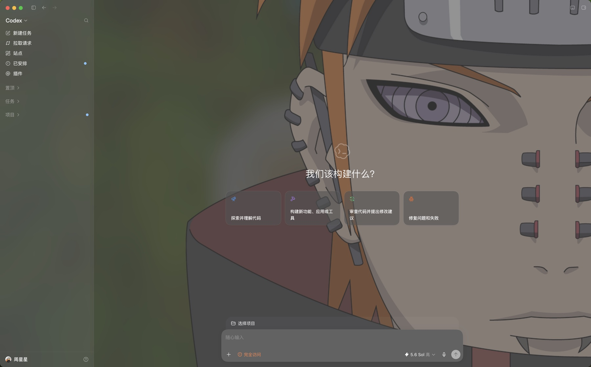
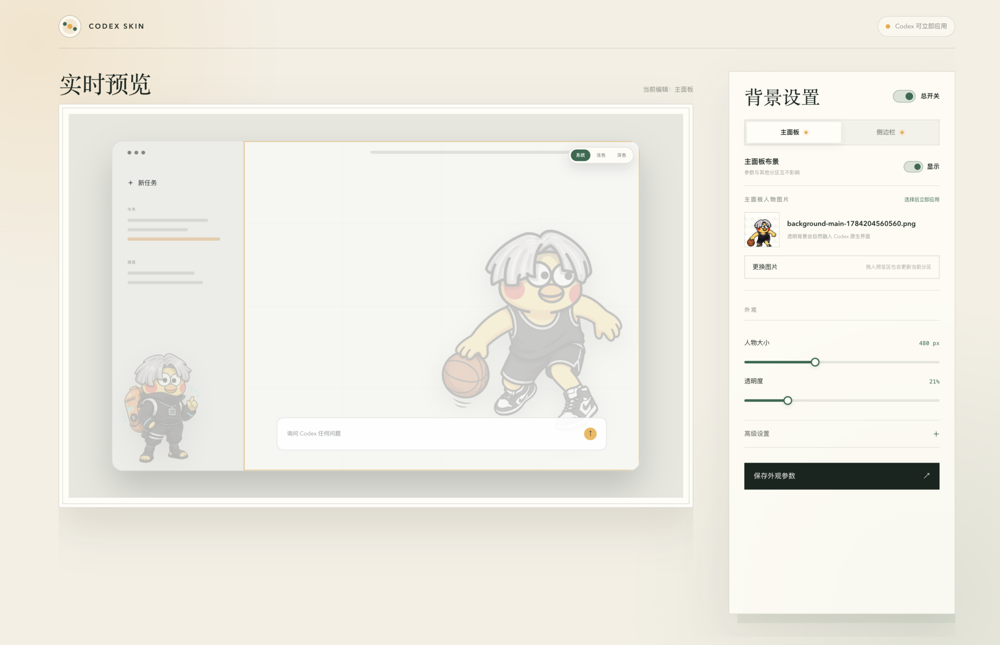

# Codex Skin：Codex 桌面端主题换装工具

Codex Skin 是一款面向 macOS Codex 桌面端的开源主题换装与界面美化工具。无需修改或重新签名 `ChatGPT.app`，即可通过可视化设置为 Codex 添加全局壁纸、主面板人物布景、侧边栏装饰和像素动画菜单栏图标，自由打造浅色、深色、二次元等个性化 Codex 主题。

[访问项目主页](https://cixiangtao.github.io/codex-skin/) ·
[下载 Apple Silicon 预览版](https://github.com/cixiangtao/codex-skin/releases/download/desktop-v1.1.2-preview.3/Codex-Skin-1.1.2-arm64.dmg) ·
[查看 Releases](https://github.com/cixiangtao/codex-skin/releases/tag/desktop-v1.1.2-preview.3) ·
[查看 npm CLI](https://www.npmjs.com/package/codex-skin)

> [!IMPORTANT]
> Codex Skin 目前仅支持 macOS，并需要已安装 Codex 桌面端。面向普通用户的正式入口是
> Codex Skin 客户端，客户端内置运行环境，无需安装 Node.js。CLI 仅作为开发、测试、无界面
> 排障和客户端故障时的兜底工具。

## 依赖环境

- Apple Silicon Mac
- Codex 桌面端；默认安装路径为 `/Applications/ChatGPT.app`

客户端用户无需安装 Node.js、Bun、TypeScript 或项目开发依赖。当前客户端仍处于开发预览阶段，
尚未完成 Apple Developer 签名、公证和 Intel Mac 构建。

## 产品入口与维护边界

- **客户端是唯一面向普通用户的产品入口**，用户安装、设置主题和日常运行都应通过客户端完成。
- **CLI 不作为普通用户的推荐使用方式**，仅用于自动化测试、开发调试、无界面排障，以及客户端
  出现问题时的兜底恢复。
- 客户端与 CLI 必须复用同一套 Core、配置格式和运行状态判断；任何新能力都先进入 Core，不允许
  在两个入口中分别实现业务逻辑。
- CLI 保持精简和稳定，不为它单独扩展交互式产品能力；用户文档、发布说明和问题引导默认以客户端
  为准。

完整决策与后续维护规则见[桌面客户端优先决策](../docs/architecture/desktop-first.md)。

## 发布渠道

- **项目主页**通过 GitHub Pages 发布，集中展示产品能力、主题效果和客户端下载入口。
- **macOS 客户端**是面向普通用户的主发布渠道，当前通过 GitHub Releases 提供 Apple
  Silicon 开发预览 DMG 和 ZIP。
- **npm CLI**是独立的开发与支持渠道，只在 Core、CLI、共享运行时、诊断或恢复能力发生变化时
  按需发布。
- 仅涉及 Electron 界面、图标或桌面打包的变化，只发布客户端即可，不需要同步发布 npm 新版本。
- 两个渠道共享 Core 和版本来源，但不要求每次发布同时产生两种分发物。

## Codex 主题换装效果

| 浅色主题                                                                                                            | 深色主题                                                                                                   |
| ------------------------------------------------------------------------------------------------------------------- | ---------------------------------------------------------------------------------------------------------- |
|  |  |

| 自定义壁纸                                                                              | 动漫主题                                                                          |
| --------------------------------------------------------------------------------------- | --------------------------------------------------------------------------------- |
|  |  |

### 可视化主题设置



## 功能特点

- 一键完成 Codex 主题换装，无需修改应用文件或重新签名
- 主面板与侧边栏可使用不同图片，也可以分别启用或关闭
- 支持独立的全局背景图，覆盖整个 Codex 窗口并保留原生半透明侧边栏
- 支持调节 Codex 原背景色的透明度，并自动跟随浅色、深色主题
- 支持从经典、像素猫和像素幽灵中选择 macOS 菜单栏图标，像素款会逐帧播放动画
- 启动后每天静默检查 GitHub Release，也支持从应用菜单或菜单栏图标手动检查更新
- 可直接下载新版 DMG、核对 Release 中的 SHA-256 校验值，并在验证通过后打开安装包
- 支持拖拽定位，以及大小、透明度、边缘柔化和 X/Y 坐标调节
- 支持 PNG、JPEG、WebP、GIF、AVIF，单张图片最大 25 MB
- 保留 PNG、WebP 图片的透明通道
- 设置保存后立即同步到已连接的 Codex 窗口，新窗口也会自动应用
- 提供环境诊断、效果验证、重载恢复验证和命令行配置能力

## 快速开始

普通用户直接下载已打包的 Apple Silicon 客户端，不需要安装 Node.js、Bun 或项目依赖：

1. 下载 [Codex-Skin-1.1.2-arm64.dmg](https://github.com/cixiangtao/codex-skin/releases/download/desktop-v1.1.2-preview.3/Codex-Skin-1.1.2-arm64.dmg)。
2. 打开 DMG，将 `Codex Skin.app` 拖入“应用程序”文件夹。
3. 打开 Codex Skin，在设置页选择图片并开启需要的背景层。

也可以下载[备用 ZIP](https://github.com/cixiangtao/codex-skin/releases/download/desktop-v1.1.2-preview.3/Codex-Skin-1.1.2-arm64.zip)，并使用
[SHA-256 校验文件](https://github.com/cixiangtao/codex-skin/releases/download/desktop-v1.1.2-preview.3/SHA256SUMS.txt)
核对产物。

> [!WARNING]
> 当前客户端未使用 Apple Developer ID 签名，也未经过 Apple 公证。如果 macOS 阻止打开，请先
> 确认下载来源与 SHA-256 校验值；尝试打开一次后，前往“系统设置 → 隐私与安全性”选择“仍要
> 打开”。Apple [说明了这一安全确认流程](https://support.apple.com/zh-cn/102445)；不信任来源
> 时不要绕过系统保护。

客户端会打开内置设置页，以仅回环可访问的 Chrome DevTools Protocol（CDP）端口启动 Codex，
自动应用当前配置，并在关闭设置窗口后继续维护所有新窗口。只有从应用菜单退出客户端时，后台
监听才会停止。

客户端不会使用需要付费 Apple Developer ID 的系统自动更新。检测到新版本后，它会下载并校验
DMG，然后打开安装包；用户仍需将新版本拖入“应用程序”文件夹并确认替换。客户端不会自行修改
现有应用，也不会在检查失败时打断正常启动。

首次使用且尚未生成配置文件时，全局背景、主面板和侧边栏默认全部关闭，也不会预选图片；
Codex 仍会直接启动，因此首次运行不会改变原生界面。之后可以在设置页主动选择图片并开启需要的
背景层。

## 可视化设置

设置页顶部提供独立的菜单栏图标选择器，选择后会立即更新 macOS 顶部状态栏并持久化；首期提供经典、像素猫和像素幽灵三种内置样式。

背景设置提供全局背景、主面板和侧边栏三个独立分区。全局背景可以：

- 从对应模块的内置素材列表快速选择，也可以继续上传自己的图片
- 选择一张窗口级壁纸，并单独启用或关闭
- 调整背景色透明度：0% 保留原色，100% 完全显示壁纸
- 在“覆盖窗口”和“完整显示”之间切换
- 调整横向和纵向焦点位置
- 保留 Codex 原生侧边栏的半透明层次

主面板和侧边栏人物布景分别可以：

- 从各自的内置素材列表快速选择，也可以继续上传自己的图片
- 单独选择图片并控制是否显示
- 直接在预览区拖动人物位置
- 调整人物大小与透明度
- 使用九宫格预设或 X/Y 滑块精确定位
- 调整边缘柔化程度

设置页中的修改会立即应用到当前已连接的 Codex 窗口。旧版单分区配置会自动迁移到主面板，无需手动处理。

## CLI（内部与兜底入口）

CLI 需要 Node.js 22+，不面向普通用户，也不作为日常使用的推荐入口。它保留以下用途：

- 自动化测试和持续集成验证
- 核心能力与启动流程的开发调试
- 服务器、远程终端等无界面环境的诊断
- 客户端无法打开或后台状态异常时的兜底检查与恢复

常用排障命令：

```bash
npx codex-skin                  # 打开设置页并启动背景模式
npx codex-skin settings         # 仅打开设置页
npx codex-skin doctor           # 检查本地运行环境
npx codex-skin verify           # 验证背景是否已正确显示
npx codex-skin verify --reload  # 重载 Codex 后验证恢复能力
npx codex-skin show             # 输出规范化后的当前配置
npx codex-skin stop             # 停止背景与设置服务，并移除已注入的布景
npx codex-skin disable          # 停止布景并持久化禁用状态
npx codex-skin enable           # 重新启用布景配置
```

### 使用命令行配置主面板

```bash
npx codex-skin configure \
  --surface main \
  --image "/图片的绝对路径/character.png" \
  --illustration-size 360 \
  --x 82 \
  --y 76 \
  --opacity 0.72 \
  --blur 0
```

### 独立配置侧边栏

```bash
npx codex-skin configure \
  --surface sidebar \
  --enable-surface \
  --image "/图片的绝对路径/sidebar-character.webp" \
  --illustration-size 240 \
  --x 50 \
  --y 80 \
  --opacity 0.24
```

主面板和侧边栏可以同时启用，二者的图片与外观参数互不影响。

## 配置与本地数据

配置文件和上传的图片默认保存在：

```text
~/.config/codex-skin/
```

可以通过 `CODEX_SKIN_HOME` 修改数据目录。为兼容已有本地环境，旧的 `CODEX_BACKGROUND_HOME` 变量仍然有效。

默认 CDP 端口由工具自动管理。如果端口已被其他进程占用，工具会选择一个空闲的回环端口并保存。也可以手动控制端口策略：

```bash
npx codex-skin configure --port 9229      # 固定使用指定端口
npx codex-skin configure --auto-port      # 恢复自动选择端口
```

只有当端口的所有监听进程都属于当前配置的 Codex 进程树时，工具才会接受该端口。

## 启动机制与安全边界

CDP 参数必须在 Codex 启动时传入。如果 Codex 已经以普通模式运行，工具会询问是否允许重启：

- 确认后，工具会先输出设置服务与等待状态，再由独立后台任务正常退出 Codex、持续轮询进程，最后以仅回环可访问的 CDP 连接重新启动并应用布景；即使 Codex 关闭了当前终端，重启任务也会继续
- 如果 Codex 再次询问是否退出，请在 Codex 中确认；Codex Skin 会一直等到 Codex 完全退出
- 拒绝后，Codex Skin 会直接退出，不会改动正在运行的 Codex

日常使用应始终通过 Codex Skin 客户端启动，让背景连接从 Codex 启动阶段即可用。CLI 启动仅用于
开发和排障。

Codex Skin 不会修改 `app.asar`、`ElectronAsarIntegrity`、应用签名、登录数据或更新程序。设置服务仅监听 `127.0.0.1`，使用随机会话令牌，并在连续 30 分钟没有请求后关闭。CDP 本身没有应用层身份验证，因此请勿将其暴露到网络。

## 本地开发

本地开发额外依赖 [Bun 1.3.14](https://bun.sh/)。Node.js 仍需满足 22+；其余 React、TypeScript、electron-vite、Vite、Tailwind CSS、Oxc 与 Vitest 依赖均由 `bun install` 安装。

```bash
bun install
bun run test     # 运行测试
bun run check    # 运行代码检查
bun run build    # 构建界面与命令行程序
bun run desktop  # 启动支持热更新的 Electron 开发环境
bun run desktop:open # 生成并打开带正式名称和图标的 Codex Skin.app
bun run site      # 启动项目主页开发服务器
bun run site:build # 构建 GitHub Pages 产物
```

`bun run desktop` 会通过 electron-vite 同时启动 Electron 主进程、设置接口与支持热更新的界面；
macOS 可能把开发宿主显示为 Electron。需要验证真实应用名称、Dock 图标或应用包元数据时，
应使用 `bun run desktop:open`。

项目使用 Bun 和 TypeScript 开发。electron-vite 统一构建 Electron 主进程与设置界面，界面基于
React、Tailwind CSS 4 和 Vite；Oxfmt、Oxlint、TypeScript 与 Vitest 分别负责格式化、代码检查、
类型检查和测试。npm 包继续提供编译后的 CLI，但它属于开发与支持工具；普通用户使用包含完整
运行环境的客户端。

项目主页位于 `apps/site/`，使用独立 Vite 配置构建到 `site-dist/`。推送到 `main` 后，
GitHub Actions 会构建并通过 GitHub Pages 发布；首次启用时需要在仓库 Pages 设置中将 Source
设为 **GitHub Actions**。

### 内置背景素材

内置素材按模块放在以下目录，设置服务会扫描目录中的图片并动态生成下拉列表，无需维护额外清单：

```text
public/backgrounds/wallpaper/  # 全局背景
public/backgrounds/main/       # 主面板人物或布景
public/backgrounds/sidebar/    # 侧边栏人物或布景
```

支持 PNG、JPEG、WebP、GIF 和 AVIF。文件名去掉扩展名后会作为选项名称，其中短横线和下划线会显示为空格。开发环境中添加或删除素材后刷新设置页即可；发布版本需要重新构建。

## 发布

桌面客户端和 npm CLI 是两个职责不同的发布渠道。发布前先根据实际变更范围选择对应分发物，
不要把 npm 包当作桌面客户端的安装入口。

### 桌面客户端

生成与 GitHub Release 一致的 Apple Silicon 预览包：

```bash
bun run desktop:dist:preview
```

产物输出到 `release/`。推送格式为 `desktop-v<版本>-preview.<序号>` 的标签后，GitHub
Actions 会重新执行代码检查与测试，构建并验证 DMG、ZIP 和 SHA-256 校验文件，然后创建 GitHub
prerelease。工作流会将完整发布标签写入客户端，使更新检测可以区分同一基础版本下的 Preview
序号。客户端不接入 Apple Developer ID 签名与公证，更新流程只负责检测、下载、SHA-256 校验和
打开 DMG；Intel Mac 构建也尚未提供，因此当前产物仍是开发预览。

普通本机打包仍可使用：

```bash
bun run desktop:dist
```

仅涉及 Electron 界面、应用图标或桌面打包的变化，不需要发布 npm CLI。

### npm CLI

只有当 Core、CLI、共享运行时、打包进 npm 的设置页，或诊断与恢复能力发生变化时，才发布 npm
新版本。

执行独立的发布前检查，不修改版本号，也不发布包：

```bash
bun run release:check
```

准备发布时启动交互式发布流程：

```bash
bun run release
```

该命令是 npm CLI 的发布流程：它会自动执行同一套发布前检查，然后更新版本号、创建发布提交与
标签、推送到远端，并将编译后的 CLI 和设置页发布到 npm；它不会构建或上传桌面安装包。

## 语言计划

当前 README 仅维护中文版本。待项目接入 i18n 后，再统一补充英文文档，避免界面与说明的语言支持不一致。

## 开源协议

本项目基于 [MIT 协议](../LICENSE) 开源。
