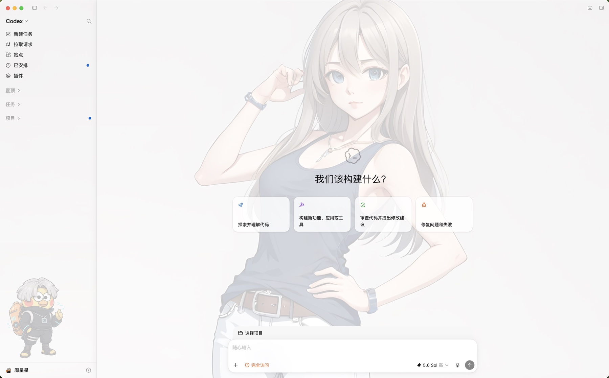
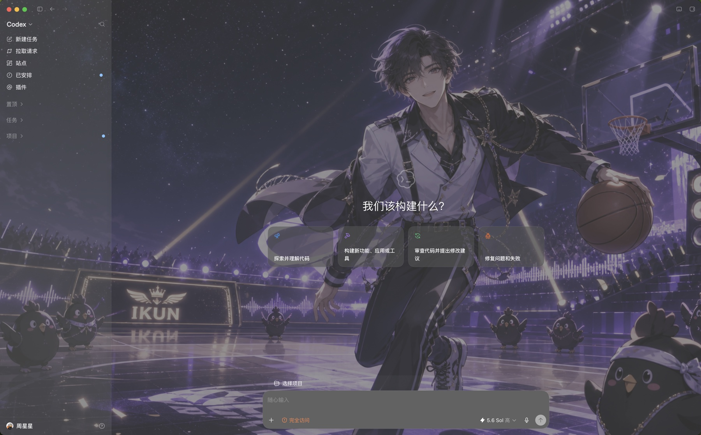
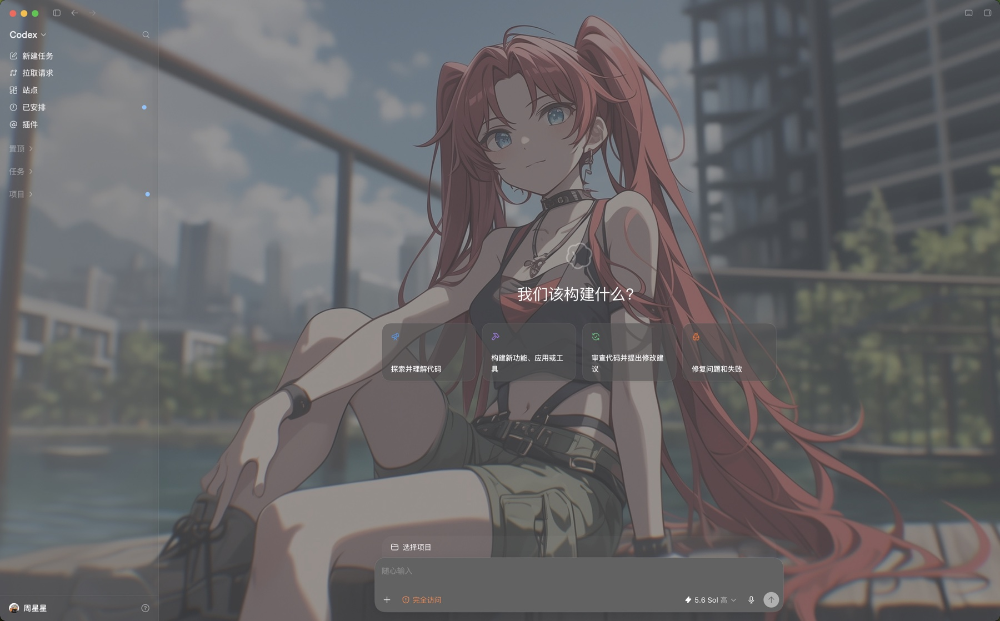
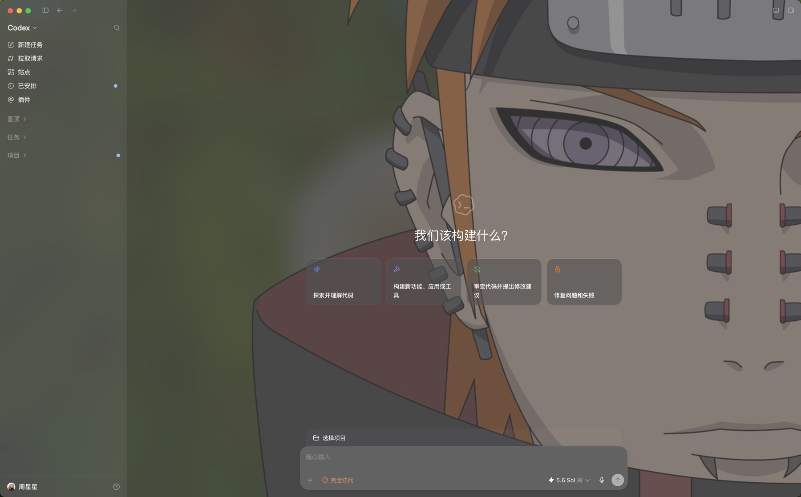
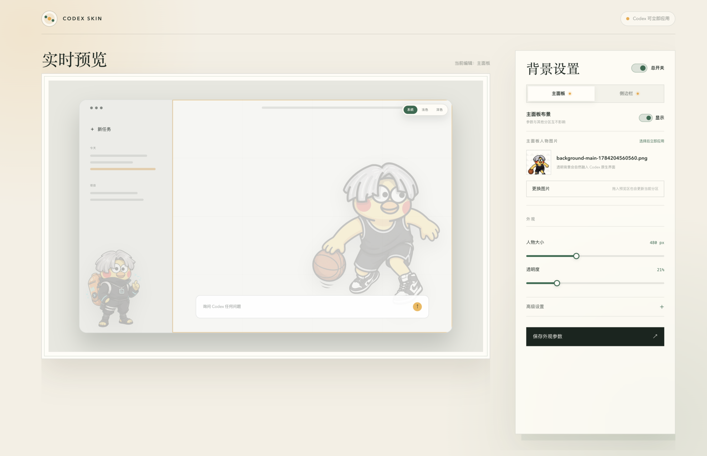

# Codex Skin: themes for the Codex desktop app

English | [简体中文](README.zh-CN.md)

Codex Skin is an open-source macOS companion for giving the Codex desktop app a personal visual theme without modifying or re-signing `ChatGPT.app`. Its desktop client controls a global wallpaper, separate main-panel and sidebar scenes, transparency, positioning, soft edges, and an animated menu-bar icon.

[Project site](https://cixiangtao.github.io/codex-skin/) · [Apple Silicon preview](https://github.com/cixiangtao/codex-skin/releases/download/desktop-v1.2.2-preview.1/Codex-Skin-1.2.2-arm64.dmg) · [Releases](https://github.com/cixiangtao/codex-skin/releases/tag/desktop-v1.2.2-preview.1) · [npm CLI](https://www.npmjs.com/package/codex-skin) · [Contributing](../CONTRIBUTING.md) · [Support](../SUPPORT.md) · [Security](../SECURITY.md)

> [!IMPORTANT]
> Codex Skin currently supports Apple Silicon macOS and requires the Codex desktop app. The packaged client is the normal user entry point and includes its runtime. The CLI exists for development, automation, headless diagnostics, and recovery.

## Product boundary

- The desktop client owns installation, visual settings, daily operation, and user-facing documentation.
- The CLI stays small and stable as a development and recovery adapter.
- Both entry points share one Core, configuration format, and runtime-state model. New behavior belongs in Core first.
- Electron-only changes do not force an npm release; Core or CLI changes can ship independently.

The rationale and maintenance rules are in [Desktop-first architecture](../docs/architecture/desktop-first.md).

## Preview

| Light theme                                                                                                                                   | Dark theme                                                                                                                    |
| --------------------------------------------------------------------------------------------------------------------------------------------- | ----------------------------------------------------------------------------------------------------------------------------- |
|  |  |

| Custom wallpaper                                                                      | Anime theme                                                                  |
| ------------------------------------------------------------------------------------- | ---------------------------------------------------------------------------- |
|  |  |



## Highlights

- Applies a theme without editing application files, signatures, login data, or the updater.
- Controls global, main-panel, and sidebar layers independently.
- Preserves light and dark appearances while adjusting the original surface opacity.
- Supports built-in classic, pixel-cat, and pixel-ghost menu-bar icons; pixel styles animate frame by frame.
- Checks GitHub Releases quietly each day and can manually check from the app menu.
- Downloads a DMG, verifies its Release SHA-256 checksum, and opens it for manual installation.
- Supports PNG, JPEG, WebP, GIF, and AVIF images up to 25 MB, including transparent PNG and WebP assets.
- Applies settings immediately to connected Codex windows and automatically handles new windows.
- Includes environment diagnostics, effect verification, reload recovery tests, and command-line configuration.

## Install the desktop preview

1. Download [Codex-Skin-1.2.2-arm64.dmg](https://github.com/cixiangtao/codex-skin/releases/download/desktop-v1.2.2-preview.1/Codex-Skin-1.2.2-arm64.dmg).
2. Open the DMG and drag `Codex Skin.app` to Applications.
3. Open Codex Skin, choose images, and enable the layers you want.

A [ZIP fallback](https://github.com/cixiangtao/codex-skin/releases/download/desktop-v1.2.2-preview.1/Codex-Skin-1.2.2-arm64.zip) and [SHA-256 checksums](https://github.com/cixiangtao/codex-skin/releases/download/desktop-v1.2.2-preview.1/SHA256SUMS.txt) are published with the preview.

> [!WARNING]
> The preview is not signed with an Apple Developer ID and is not notarized. Verify the GitHub Release source and checksum. If macOS blocks the app, try opening it once, then use System Settings → Privacy & Security → Open Anyway. Do not bypass the protection for an untrusted download.

Codex Skin starts Codex with a loopback-only Chrome DevTools Protocol connection, applies the current configuration, and keeps watching new windows after the settings window closes. It stops only when you quit from the app menu. On first use, all background layers are disabled and no image is preselected, so the native Codex interface remains unchanged until you opt in.

## Visual settings

The global layer can choose a built-in or uploaded wallpaper, switch between cover and contain, set horizontal and vertical focus, and control how much of the original background remains visible. The main-panel and sidebar layers each choose their own image, size, opacity, position, and edge softness. Dragging in the preview and numeric controls update the connected Codex window immediately.

Legacy single-surface configuration migrates to the main-panel layer automatically.

## CLI: development and recovery

The CLI requires Node.js 22+ and is not the recommended daily user path.

```bash
npx codex-skin                  # settings plus background runtime
npx codex-skin settings         # settings only
npx codex-skin doctor           # environment diagnostics
npx codex-skin verify           # verify the applied scene
npx codex-skin verify --reload  # verify recovery after reload
npx codex-skin show             # normalized configuration
npx codex-skin stop             # stop services and remove injected scenes
npx codex-skin disable          # stop and persist disabled state
npx codex-skin enable           # re-enable the saved scene
```

```bash
npx codex-skin configure \
  --surface main \
  --image "/absolute/path/character.png" \
  --illustration-size 360 \
  --x 82 \
  --y 76 \
  --opacity 0.72 \
  --blur 0
```

Main-panel and sidebar scenes can be enabled together and keep independent assets and appearance values.

## Local data and security boundary

Configuration and uploaded images live under `~/.config/codex-skin/` by default. Set `CODEX_SKIN_HOME` to change the directory; `CODEX_BACKGROUND_HOME` remains supported for existing installations.

Codex Skin chooses an available loopback CDP port and records it. A fixed port can be set with `npx codex-skin configure --port 9229`; `--auto-port` restores automatic selection. A port is accepted only when every listener belongs to the configured Codex process tree.

The settings service listens on `127.0.0.1`, requires a random session token, and closes after 30 minutes without requests. CDP has no application-level authentication, so never expose its port to a network. Codex Skin does not modify `app.asar`, Electron integrity metadata, application signatures, login data, or the updater.

## Development

Install Node.js 22+, Bun 1.3.14, and the Codex desktop app.

```bash
bun install --frozen-lockfile
bun run test
bun run check
bun run ci
bun run build
bun run desktop
bun run desktop:open
bun run site
bun run site:build
```

Use `bun run desktop` for hot reload. Use `bun run desktop:open` when validating the real application name, Dock icon, or bundle metadata.

Built-in assets are discovered under `public/backgrounds/wallpaper/`, `public/backgrounds/main/`, and `public/backgrounds/sidebar/`; no separate manifest is required.

## Delivery

- GitHub Pages presents the product, previews, and desktop download.
- GitHub Releases publishes the Apple Silicon desktop preview.
- npm publishes the CLI only when Core, CLI, shared runtime, diagnostics, or recovery behavior changes.

The desktop preview uses `desktop-v<version>-preview.<number>` and `config/release.json`. The npm CLI uses `v<version>` and `package.json`. Each channel has a constrained, Actions-owned release path. See the [release process](../docs/release-process.md).

## Community

Read [Support](../SUPPORT.md) for compatibility boundaries, use the issue forms for reproducible bugs, report sensitive vulnerabilities through [Security](../SECURITY.md), and run the relevant checks before opening a pull request described in [Contributing](../CONTRIBUTING.md).

Codex Skin is an unofficial open-source project and is not affiliated with OpenAI.

## License

[MIT](../LICENSE)
