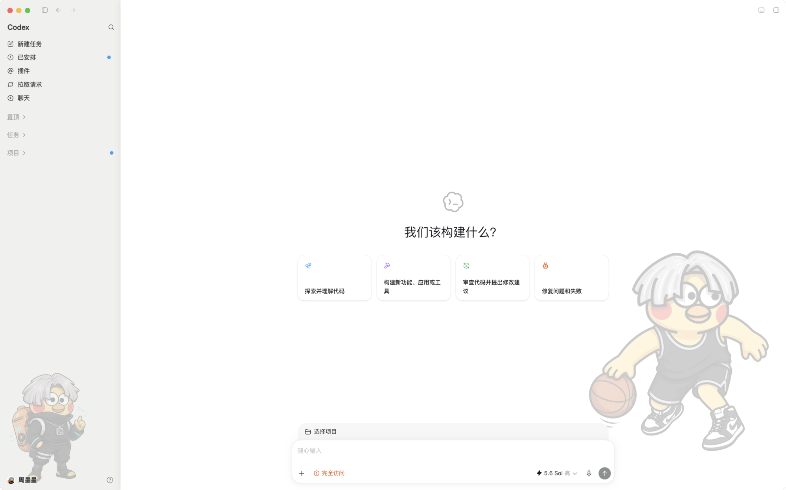
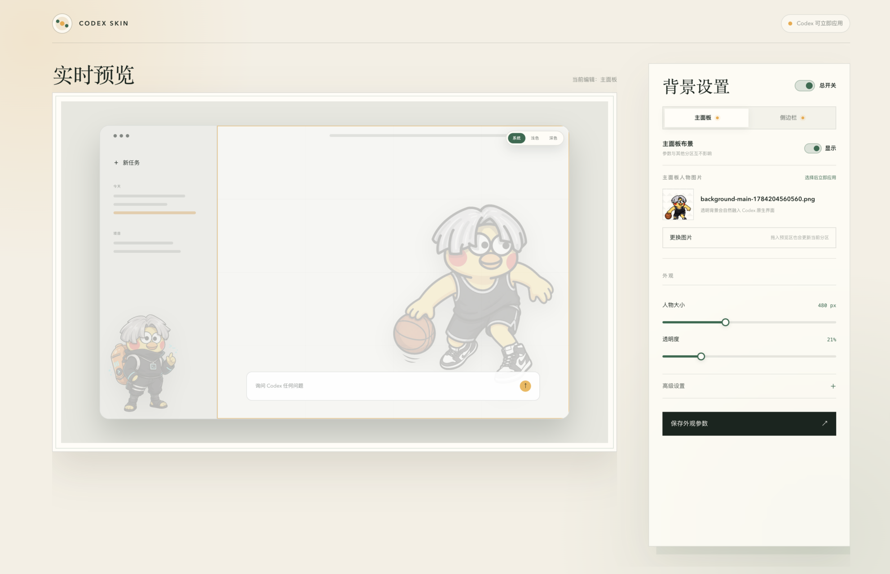

# Codex Skin

为 Codex 桌面端添加透明人物布景的本地外观工具。它通过可视化设置页分别管理主面板和侧边栏，不修改、不重新签名 `ChatGPT.app`。

## 效果展示

**Codex 主界面**



**可视化设置页**



## 功能特点

- 主面板与侧边栏可使用不同图片，也可以分别启用或关闭
- 支持拖拽定位，以及大小、透明度、边缘柔化和 X/Y 坐标调节
- 支持 PNG、JPEG、WebP、GIF、AVIF，单张图片最大 25 MB
- 保留 PNG、WebP 图片的透明通道
- 设置保存后立即同步到已连接的 Codex 窗口，新窗口也会自动应用
- 提供环境诊断、效果验证、重载恢复验证和命令行配置能力

## 快速开始

运行环境：

- macOS
- Node.js 22 或更高版本（包含 npm 与 `npx`）
- Codex 桌面端安装在 `/Applications/ChatGPT.app`

直接运行：

```bash
npx codex-skin
```

该命令会打开本地设置页，以仅回环可访问的 Chrome DevTools Protocol（CDP）端口启动 Codex，注入已配置的人物布景，并在后台保持所有新窗口同步。Codex 退出后，后台进程也会随之结束。

首次使用时还没有人物图片，工具会先打开设置页。选择图片、调整效果，然后点击「启动背景模式」即可。终端会持续显示设置服务、背景守护进程和 Codex CDP 的端口与 PID，并提供可直接复制的停止命令。

## 可视化设置

设置页将主面板和侧边栏作为两个独立分区。每个分区都可以：

- 单独选择图片并控制是否显示
- 直接在预览区拖动人物位置
- 调整人物大小与透明度
- 使用九宫格预设或 X/Y 滑块精确定位
- 调整边缘柔化程度

设置页中的修改会立即应用到当前已连接的 Codex 窗口。旧版单分区配置会自动迁移到主面板，无需手动处理。

## 常用命令

```bash
npx codex-skin                  # 打开设置页并启动背景模式
npx codex-skin settings         # 仅打开设置页
npx codex-skin doctor           # 检查本地运行环境
npx codex-skin verify           # 验证背景是否已正确显示
npx codex-skin verify --reload  # 重载 Codex 后验证恢复能力
npx codex-skin show             # 输出规范化后的当前配置
npx codex-skin stop             # 停止背景与设置服务，并移除已注入的布景
npx codex-skin disable          # 停止布景并持久化禁用状态
npx codex-skin enable           # 重新启用布景配置
```

### 使用命令行配置主面板

```bash
npx codex-skin configure \
  --surface main \
  --image "/图片的绝对路径/character.png" \
  --illustration-size 360 \
  --x 82 \
  --y 76 \
  --opacity 0.72 \
  --blur 0
```

### 独立配置侧边栏

```bash
npx codex-skin configure \
  --surface sidebar \
  --enable-surface \
  --image "/图片的绝对路径/sidebar-character.webp" \
  --illustration-size 240 \
  --x 50 \
  --y 80 \
  --opacity 0.24
```

主面板和侧边栏可以同时启用，二者的图片与外观参数互不影响。

## 配置与本地数据

配置文件和上传的图片默认保存在：

```text
~/.config/codex-skin/
```

可以通过 `CODEX_SKIN_HOME` 修改数据目录。为兼容已有本地环境，旧的 `CODEX_BACKGROUND_HOME` 变量仍然有效。

默认 CDP 端口由工具自动管理。如果端口已被其他进程占用，工具会选择一个空闲的回环端口并保存。也可以手动控制端口策略：

```bash
npx codex-skin configure --port 9229      # 固定使用指定端口
npx codex-skin configure --auto-port      # 恢复自动选择端口
```

只有当端口的所有监听进程都属于当前配置的 Codex 进程树时，工具才会接受该端口。

## 启动机制与安全边界

CDP 参数必须在 Codex 启动时传入。如果 Codex 已经以普通模式运行，工具会询问是否允许重启：

- 确认后，工具会正常退出 Codex，等待进程结束，再以仅回环可访问的 CDP 连接重新启动并应用布景
- 拒绝后，Codex Skin 会直接退出，不会改动正在运行的 Codex

后续建议始终通过 `npx codex-skin` 启动，让背景连接从 Codex 启动阶段即可用。

Codex Skin 不会修改 `app.asar`、`ElectronAsarIntegrity`、应用签名、登录数据或更新程序。设置服务仅监听 `127.0.0.1`，使用随机会话令牌，并在连续 30 分钟没有请求后关闭。CDP 本身没有应用层身份验证，因此请勿将其暴露到网络。

## 本地开发

```bash
bun install
bun dev          # 同时启动可视化界面与本地接口
bun dev:ui       # 仅启动界面，监听 127.0.0.1:4178
bun dev:server   # 仅启动设置接口，监听 127.0.0.1:4179
bun run test     # 运行测试
bun run check    # 运行代码检查
bun run build    # 构建界面与命令行程序
```

`bun dev` 会为本地开发会话完成身份验证并打开设置页；按下 `Ctrl+C` 后，两个子进程会一并停止。

项目使用 Bun 和 TypeScript 开发，设置界面基于 React、Tailwind CSS 4、Vite+ 与 Vite，测试使用 Vitest。npm 包会发布为编译后的 Node.js 可执行程序，最终用户无需安装 Bun 或 TypeScript。

## 发布

执行独立的发布前检查，不修改版本号，也不发布包：

```bash
bun run release:check
```

准备发布时启动交互式发布流程：

```bash
bun run release
```

发布命令会自动执行同一套发布前检查，然后更新版本号、创建发布提交与标签、推送到远端，并将编译后的包发布到 npm。

## 语言计划

当前 README 仅维护中文版本。待项目接入 i18n 后，再统一补充英文文档，避免界面与说明的语言支持不一致。

## 开源协议

本项目基于 [MIT 协议](./LICENSE) 开源。
